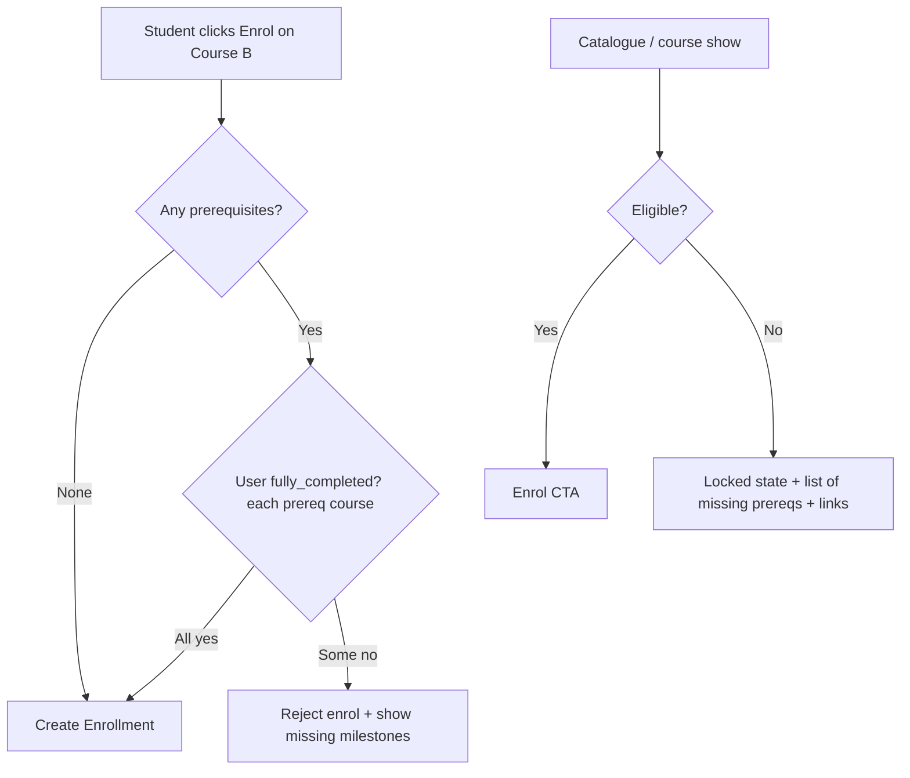
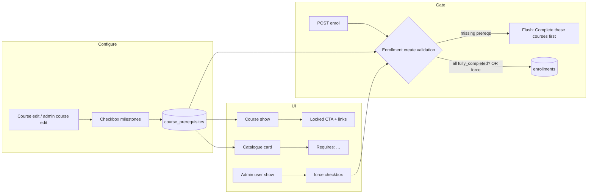
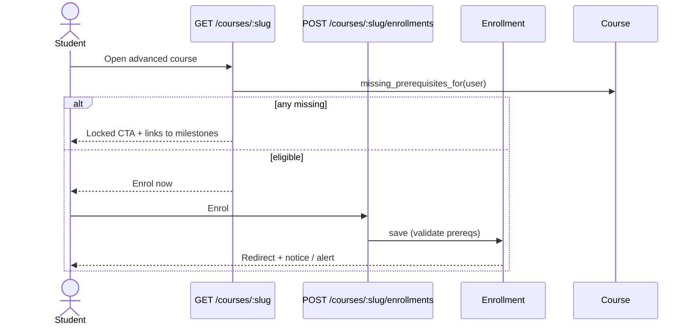

# Planning: Course Prerequisites (Milestone Enrollment Gating)

**Status:** Implemented (v1)  
**Area:** Enrolment / catalogue  
**Related code today:** `CoursePrerequisite`, `Enrollment` create validation, course form / show / card, admin force-enrol

---

## 1. Problem

Students can enrol in any published course with no ordering. Product needs **milestone / prerequisite courses**: one or more courses a learner must **complete successfully** before they may enrol in a more advanced course.

Today:

- `EnrollmentsController#create` only checks CanCan `:create` and uniqueness `(user, course)`.
- Admin can force-enrol via `Admin::UsersController#enroll` with the same gap.
- “Passed a course” already exists as `Enrollment#fully_completed?` (all lessons’ progresses `completed`) and drives certificate eligibility.

---

## 2. Goals

| Goal | Detail |
|------|--------|
| **Configure** | Instructors (own courses) and admins can attach one or more prerequisite courses to a target course. |
| **Gate enrol** | Student self-enrol is blocked until all prerequisites are completed for that user. |
| **Communicate** | Always **lock + show** in catalogue/course show; UI lists missing milestones. Never hide advanced courses solely because of prereqs. |
| **Reuse completion** | “Passed” = `Enrollment#fully_completed?` only (not certificate). |
| **Safe graph** | No circular prerequisite chains. |

### Non-goals (v1)

- Lesson-level prerequisites inside a course (already partly covered by required materials).
- Soft “recommended” prerequisites without hard gate.
- Time-based unlocks or cohort unlocks.
- OR groups / “any N of M” prerequisites.
- Requiring an issued certificate to count as “passed.”
- Auto-unenrol when a prereq is added later (grandfather existing enrolments).
- Audit column `enrolled_by_admin_id` (admin override ships without it; audit later if needed).

---

## 3. Proposed behaviour



### “Successfully completed” definition (v1) — decided

Reuse **`Enrollment#fully_completed?`** for the prerequisite course:

- Course has ≥ 1 lesson, and  
- Count of completed progresses for that enrolment ≥ lesson count.

Do **not** require a `Certificate`. Courses without certificate layout still work as milestones; certificates remain a derived reward of completion.

Instructors / admins completing a course as a learner use the same rule.

### Multiple prerequisites — decided

**AND** only: every listed prerequisite must be completed. No OR groups in v1.

### Who is gated — decided

| Actor | Behaviour |
|-------|-----------|
| Student self-enrol | Hard block |
| Instructor viewing own advanced course | Authoring unaffected; enrol-as-student still gated |
| Admin force-enrol | **Override allowed** with explicit confirmation (no audit column in v1) |
| Guest | Cannot enrol (unchanged). **Can see** locked advanced courses when `public_access_enabled` (+ site guest access), with milestones listed |

---

## 4. Data model

### New join table: `course_prerequisites`

| Column | Type | Notes |
|--------|------|--------|
| `id` | bigint | PK |
| `course_id` | bigint | The **advanced** course (FK → `courses`, `null: false`) |
| `prerequisite_course_id` | bigint | The **milestone** course (FK → `courses`, `null: false`) |
| `position` | integer | Optional display order (default 0) |
| `created_at` / `updated_at` | datetime | |

**Indexes / constraints**

- Unique `(course_id, prerequisite_course_id)`
- Check: `course_id != prerequisite_course_id`
- Index on `prerequisite_course_id` (for “what unlocks if I finish X?”)

**Model sketch**

```ruby
# CoursePrerequisite
belongs_to :course
belongs_to :prerequisite_course, class_name: "Course"

# Course
has_many :course_prerequisites, dependent: :destroy
has_many :prerequisite_courses, through: :course_prerequisites, source: :prerequisite_course
has_many :inverse_course_prerequisites, class_name: "CoursePrerequisite",
         foreign_key: :prerequisite_course_id, dependent: :restrict_with_error
has_many :unlocks_courses, through: :inverse_course_prerequisites, source: :course
```

`dependent: :restrict_with_error` on inverse side prevents deleting a milestone course that still gates others (clearer than silent cascade).

### Cycle prevention

On create/update of a prerequisite edge `B ← A` (A required for B):

1. Reject if `A.id == B.id`.
2. Reject if `A` is reachable from `B` in the existing digraph (DFS/BFS on `prerequisite_courses`), i.e. adding the edge would create a cycle.

Keep validation on `CoursePrerequisite` so admin API and UI cannot diverge.

---

## 5. Domain API (thin, reusable)

Prefer one place so controllers and views stay dumb:

```ruby
# e.g. app/models/course.rb or app/services/course_prerequisite_gate.rb

Course#prerequisite_courses
Course#prerequisites_met_by?(user)  # true if no prereqs or all fully_completed?
Course#missing_prerequisites_for(user)  # [Course, ...]

Enrollment  # before_validation / validate on create:
  # errors.add(:course, ...) unless course.prerequisites_met_by?(user)
```

Admin override:

```ruby
Enrollment.create!(..., skip_prerequisite_check: true) # or service flag
# Only callable from Admin::UsersController after authorize admin
```

Do **not** only check in the controller — model validation catches seeds, console, and future APIs.

---

## 6. Enforcement points

| Location | Change |
|----------|--------|
| `Enrollment` model | Validation on create: prerequisites met (unless override) |
| `EnrollmentsController#create` | Rely on model errors; friendly flash listing missing courses |
| `Admin::UsersController#enroll` | Default: same gate; checkbox / confirm param `force: true` for override |
| `Ability` (optional) | Keep `:create, Enrollment` as today; gate is domain validation, not CanCan (clearer errors). Optionally add a custom action `:enrol_if_eligible` later |
| API (if any future enrol endpoint) | Same model validation |

Unenrol / destroy: unchanged.

Existing enrolments when a prereq is **added later**: **grandfather** — leave enrolled. Do not auto-remove.

---

## 7. UX / UI

### 7.1 Instructor / admin — configure

- On **course edit** (owner) and **admin course edit**: multi-select or searchable list of other courses as prerequisites.
- Show selected milestones with remove + optional reorder.
- Warn if selected course is unpublished (still allowed — useful for staging paths).
- Error toast if cycle detected.

Files likely touched:

- `app/views/courses/_fields.html.haml` / admin course form
- `CoursesController` / `Admin::CoursesController` strong params: `prerequisite_course_ids: []`
- Sync association with `course.prerequisite_course_ids = [...]`

### 7.2 Student — course show

When signed in, not enrolled, prerequisites unmet:

- Replace primary **Enrol now** with locked CTA (disabled or non-submitting).
- List missing milestones: title + link to each course + status (not enrolled / in progress / completed).
- If some prereqs done, show progress (e.g. 1 of 2).

When eligible: existing enrol button.

Guest on public course: show “Sign in to enrol” plus milestone list (read-only).

### 7.3 Catalogue / home / subject index — decided

**Always show + lock** (never hide because of prerequisites). Discoverability of the learning path matters more than decluttering.

Card badge: “Requires: …” or lock icon + tooltip.

Optional later polish (not blocking v1): “Available to me” filter (prereqs met or already enrolled).

### 7.4 Copy / terminology

Use SiteSetting terminology if present (`course`, etc.). Prefer product language **“milestone”** in admin help text, **“prerequisite”** in technical docs — pick one student-facing string and stick to it (suggest: “Complete these courses first”).

---

## 8. Implementation plan (phased)

### Phase 0 — Spec lock

Product decisions are locked in §10. Skip further debate; start Phase 1.

### Phase 1 — Schema + model (1 day)

1. Migration `create_course_prerequisites`.
2. `CoursePrerequisite` model + validations (uniqueness, not self, cycle).
3. `Course` associations + `prerequisites_met_by?` / `missing_prerequisites_for`.
4. `Enrollment` create validation + admin skip flag.
5. Unit tests: cycle, AND logic, completed vs incomplete, skip flag.

### Phase 2 — Enrolment enforcement (½–1 day)

1. `EnrollmentsController` flash with missing titles.
2. Admin enrol UI: force override.
3. Request/integration tests for student block + admin override.

### Phase 3 — Authoring UI (1 day)

1. Course form multi-select / collection checkboxes for prerequisites.
2. Strong params + replace association.
3. Instructor authorization: can only attach courses they can `:read` (admins: all).

### Phase 4 — Student UX (1 day)

1. Course show locked state.
2. Catalogue card indicator.
3. Optional “Available to me” filter.
4. System / feature tests for happy path: finish A → enrol B.

### Phase 5 — Polish (optional)

1. On prereq course completion, optional notice “You unlocked: …” (flash on last lesson complete or certificate page).
2. Admin report: blocked enrol attempts (if we log them — not required).
3. Document in `docs/architecture-overview.md` under Learning flows.

---

## 9. Test plan

| Case | Expect |
|------|--------|
| Course with no prereqs | Enrol works as today |
| Prereq incomplete / no enrolment | Student create enrolment fails with clear error |
| All prereqs `fully_completed?` | Enrol succeeds |
| Self-reference | Validation error |
| A→B and B→A | Second edge rejected |
| A→B→C cycle via A→C | Rejected |
| Admin enrol without force | Same as student |
| Admin enrol with force | Succeeds |
| Add prereq after student already enrolled | Student stays enrolled |
| Delete milestone course still referenced | Restricted / error |
| Unpublished prereq | Still counts for completion if student somehow completed it; listing shows title |

Fixtures: two published courses; user with completed enrolment on A only.

---

## 10. Decided product rules (locked)

These are the efficient defaults — implement exactly this; no further product branching in v1.

| Topic | Decision | Why (efficiency) |
|-------|----------|------------------|
| Catalogue UX | **Lock + show** (never hide for prereqs) | One UI path; no SiteSetting toggle; learning path stays visible |
| Pass rule | **`fully_completed?` only** | Already exists; no certificate coupling; works without cert templates |
| Admin override | **Yes**, confirm UI; **no** `enrolled_by_admin_id` in v1 | Unblocks ops with minimal schema; audit later if needed |
| Cross-instructor prereqs | **Any course in the LMS**; picker limited to courses the editor can `:read` | Simplest graph; admins see all; instructors see what they can already browse |
| Retroactive prereqs | **Grandfather** existing enrolments | No migration/job; no surprise unenrols |
| OR groups | **Out of scope** | AND-only join table stays trivial |
| Guests on public catalogue | **Show locked** advanced courses if `public_access_enabled` (+ guest access), list milestones | Same lock+show path as signed-in users; no guest-specific hide logic |

### Authoring picker (cross-instructor)

- Admin: any course (except self / cycle).
- Instructor: courses they `can?(:read, course)` (published catalogue + own drafts as Ability already allows).

---

## 11. Risks & mitigations

| Risk | Mitigation |
|------|------------|
| Circular configs | Graph validation on every edge |
| Instructors lock themselves out of testing | Admin force-enrol; or temporary empty prereq list |
| Completion definition drifts from certificates | Document single source: `fully_completed?`; cert remains derived |
| Performance on catalogue (N prereq checks) | Prefetch user’s completed course IDs once per request (`Set` of course_ids where enrolment fully completed — or cache completed course_ids on user for the request) |
| Deleting / unpublishing a milestone | `restrict_with_error`; UI warns before destroy |

---

## 12. Rollout

1. Ship schema + model validation behind no UI → safe default (no rows = no behaviour change).
2. Ship admin/instructor config UI.
3. Ship student locked UI.
4. Optionally announce: existing paths unchanged until instructors attach milestones.

No data backfill required.

---

## 13. File touch list (expected)

```
db/migrate/XXXX_create_course_prerequisites.rb
app/models/course_prerequisite.rb
app/models/course.rb
app/models/enrollment.rb
app/controllers/enrollments_controller.rb
app/controllers/admin/users_controller.rb
app/controllers/courses_controller.rb          # strong params
app/controllers/admin/courses_controller.rb    # strong params
app/views/courses/show.html.haml
app/views/courses/_fields.html.haml            # or new partial
app/views/courses/_card.html.haml              # lock badge
app/views/admin/users/show.html.haml           # force enrol
config/locales/*.yml
test/models/course_prerequisite_test.rb
test/models/enrollment_test.rb
test/controllers/enrollments_controller_test.rb
docs/architecture-overview.md                  # short section after ship
```

---

## 14. Success criteria

- Instructor can attach milestones to a course and save without cycles.
- Student cannot enrol in the advanced course until every milestone is `fully_completed?`.
- UI explains what remains.
- Admin can override when needed.
- Existing courses with zero prerequisites behave exactly as today.
- Tests cover gate, cycle, and admin override.

---

## 15. One-line summary

Add a `course_prerequisites` join, validate enrolment against `Enrollment#fully_completed?` on each prerequisite (AND), expose config on course edit, and show a locked enrol state on the advanced course until milestones are done — with admin force-enrol as the escape hatch.

---

## 16. As-built (what shipped in v1)



### Enrol decision (runtime)



### Files that landed

| Piece | Path |
|-------|------|
| Migration | `db/migrate/20260720000000_create_course_prerequisites.rb` |
| Model | `app/models/course_prerequisite.rb` |
| Course API | `Course#missing_prerequisites_for`, `#prerequisites_met_by?`, `.prerequisite_options_for` |
| Gate | `Enrollment` `validate :prerequisites_must_be_met, on: :create` + `skip_prerequisite_check` |
| Student enrol | `app/controllers/enrollments_controller.rb` |
| Admin force | `app/controllers/admin/users_controller.rb#enroll` + `app/views/admin/users/show.html.haml` |
| Authoring UI | `app/views/courses/_fields.html.haml` |
| Student UI | `app/views/courses/show.html.haml`, `app/views/courses/_card.html.haml` |
| Tests | `test/models/course_prerequisite_test.rb`, `enrollment_test.rb`, `enrollments_controller_test.rb` |

**Not in v1 (intentionally):** “Available to me” catalogue filter, unlock flash after completing a milestone, `enrolled_by_admin_id` audit column, OR-groups.

---

## 17. Manual test guide

Use this to verify the feature in the browser. Automated tests cover the gate; this guide is for humans.

### 17.1 Base URL and accounts

Replace `{HOST}` with your running app (examples: `http://localhost:3000` or `http://localhost:3001`).

| Role | Sign-in URL | Email (seed default) | Password |
|------|-------------|----------------------|----------|
| Sign in | `{HOST}/users/sign_in` | — | — |
| Instructor | same | `instructor@example.com` | from `bin/rails db:seed` output / `SEED_INSTRUCTOR_PASSWORD` |
| Student | same | `student@example.com` | from seed / `SEED_STUDENT_PASSWORD` |
| Admin | same | `admin@example.com` (or `SEED_ADMIN_EMAIL`) | from seed / `SEED_ADMIN_PASSWORD` |

Seed courses (after `bin/rails db:seed`):

| Slug | Title | Useful as |
|------|-------|-----------|
| `intro-to-ruby` | Introduction to Ruby | Milestone (A) — student is often already enrolled |
| `linear-algebra-foundations` | Linear Algebra: Foundations | Advanced (B) — attach A as prerequisite |

Exact course URLs:

- Catalogue: `{HOST}/courses`
- Milestone A: `{HOST}/courses/intro-to-ruby`
- Advanced B: `{HOST}/courses/linear-algebra-foundations`
- Edit B (instructor): `{HOST}/courses/linear-algebra-foundations/edit`
- Admin courses: `{HOST}/admin/courses`
- Admin edit B: `{HOST}/admin/courses/linear-algebra-foundations/edit` (slug or id works)
- Admin users: `{HOST}/admin/users`

### 17.2 Scenario A — Configure milestones (instructor)

1. Sign in as **instructor** → `{HOST}/users/sign_in`
2. Open `{HOST}/courses/linear-algebra-foundations/edit`
3. Scroll to **Complete these courses first (milestones)**
4. Tick **Introduction to Ruby** (`intro-to-ruby`)
5. Save the course
6. Open catalogue `{HOST}/courses` — advanced card should show `Requires: Introduction to Ruby` when the viewer has not completed that milestone (and is not already enrolled in B)

### 17.3 Scenario B — Student blocked from enrol

1. Use a student who has **not** fully completed `intro-to-ruby`  
   - Prefer the dedicated test accounts (no enrolments):  
     - `student-prereq-a@example.com` / `student123`  
     - `student-prereq-b@example.com` / `student123`  
     - `student-prereq-c@example.com` / `student123`  
   - Seed `student@example.com` is enrolled in intro-to-ruby but may not have finished every lesson — complete or leave incomplete intentionally.  
2. Open `{HOST}/courses/linear-algebra-foundations`
3. **Expect:** “Complete these courses first” list with a link to `{HOST}/courses/intro-to-ruby`, and **Enrol now** disabled (not a working submit)
4. Click the milestone link → lands on `{HOST}/courses/intro-to-ruby`
5. If you still POST enrol somehow, flash alert: `Complete these courses first: …` and stay on the advanced course

### 17.4 Scenario C — Student unlocks after completing milestone

1. On `{HOST}/courses/intro-to-ruby`, finish **all** lessons so the enrolment is `fully_completed?` (progress status completed on every lesson — same rule as certificates)
2. Return to `{HOST}/courses/linear-algebra-foundations`
3. **Expect:** normal **Enrol now** button
4. Click enrol → `{HOST}/courses/linear-algebra-foundations/enrollments` (POST) → redirect back with success notice and enrolment UI (progress ring)

### 17.5 Scenario D — Guest sees lock (public course)

1. Sign out
2. Ensure advanced course is **published** and **Allow public access** is on (course edit toggle)
3. Open `{HOST}/courses/linear-algebra-foundations`
4. **Expect:** sign-in prompt **and** “Complete these courses first” list with milestone links
5. Catalogue `{HOST}/courses` still lists the course (lock + show, not hidden)

### 17.6 Scenario E — Admin force-enrol

1. Sign in as **admin** → `{HOST}/admin/users`
2. Open a user who is blocked by prerequisites (e.g. student show page): `{HOST}/admin/users/{id}`
3. Under **Force-enrol in course**, pick `Linear Algebra: Foundations`
4. Without **Skip prerequisite check** → enrol should fail with the same “Complete these courses first” message
5. Tick **Skip prerequisite check (force)** → enrol succeeds
6. Confirm on `{HOST}/courses/linear-algebra-foundations` while signed in as that user (or check enrolments on the admin user page)

### 17.7 Scenario F — Cycle rejected

1. Edit `{HOST}/courses/intro-to-ruby/edit` and set prerequisite = Linear Algebra  
2. Edit `{HOST}/courses/linear-algebra-foundations/edit` and try to set prerequisite = Intro to Ruby while the reverse edge exists  
3. **Expect:** save fails / association error — circular dependency (model validation). Clear one side and retry.

### 17.8 Quick URL cheat sheet

```text
{HOST}/users/sign_in
{HOST}/courses
{HOST}/courses/intro-to-ruby
{HOST}/courses/intro-to-ruby/edit
{HOST}/courses/linear-algebra-foundations
{HOST}/courses/linear-algebra-foundations/edit
{HOST}/courses/linear-algebra-foundations/enrollments          # POST enrol
{HOST}/admin/courses
{HOST}/admin/courses/linear-algebra-foundations/edit
{HOST}/admin/users
{HOST}/admin/users/:id                                        # force-enrol form
```

### 17.9 Pass / fail checklist

| # | Check | Pass? |
|---|--------|-------|
| 1 | Milestones save on course edit | ☐ |
| 2 | Catalogue shows “Requires: …” when locked | ☐ |
| 3 | Course show blocks enrol with linked milestones | ☐ |
| 4 | Completing all lessons on A unlocks enrol on B | ☐ |
| 5 | Guest sees list + sign-in (public course) | ☐ |
| 6 | Admin force without checkbox fails; with checkbox works | ☐ |
| 7 | Circular prerequisites rejected | ☐ |
| 8 | Course with no milestones behaves as before | ☐ |
